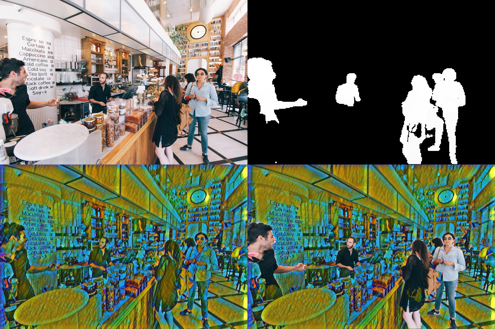

# seg-style

[English](https://github.com/wzlyo/seg-style) | **中文**

一种结合了 [Light-Weight Refinenet](https://github.com/DrSleep/light-weight-refinenet) 和 [Fritz Style Transfer Network](https://github.com/fritzlabs/fritz-models/tree/master/style_transfer) 的实时视频人像前后景处理应用。 

运行 Demo 可以得到如下图像输入的结果。

>左上角：原图。 右上角：Light-weight refinenet 输出的蒙版。 左下角：风格迁移模型输出的风格化图像。 右下角：opencv-python 处理后输出的最终结果。

## 训练和转换模型

如果你要搭建训练这些网络的环境或转换为移动平台使用的模型，请到原来的两个项目中查阅`README.md`文件。若要运行 Demo ，只需直接按要求安装环境并下载预训练模型。

## 运行Demo

Demo 同时运行在 Tensorflow 骨干的 Keras 和 PyTorch 上。确保你安装了两个深度学习框架。已在 Windows 10 和 Ubuntu 18.04 测试，GTX1050ti 笔记本达到 19fps.

### 环境设置

你可以使用 conda 或 pip 设置环境。可能需要单独安装[keras-contrib](https://github.com/keras-team/keras-contrib)。

### 实时Demo

运行`demo.py`会使用`tmp.jpg`作为输入并输出用三个不同分割模型处理后的结果。实时`demo_rt.py`显示 opencv-python 捕捉的摄像头画面处理后结果。初次运行会下载三个预训练 Light-weight refinenet 模型文件。
