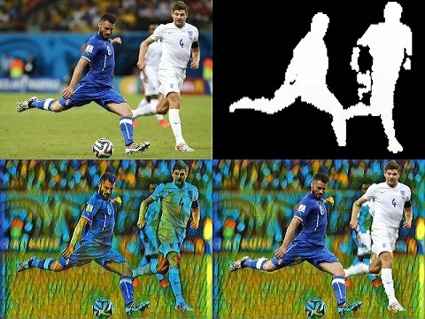

# seg-style
**English** | [中文](./README.CN.md)

A real-time opencv camera process combined with [Light-Weight Refinenet](https://github.com/DrSleep/light-weight-refinenet) and [Fritz Style Transfer Network](https://github.com/fritzlabs/fritz-models/tree/master/style_transfer). 

This repository contains code for both deep learning networks repositories.

Running demo of this repository can get the result of an input image like picture below.



Top left: Original image. Top right: Mask output from light-weight refinenet. Down left: Stylized image output from the style transfer model. Down right: Final output processed with opencv-python.

## Training and converting models

If you'd like to setup the training environment of the network or convert to mobile version, check out the original README.md of the two repositories.To run demos, just simply install the python requirements and download the pretrained models of the two networks.

## Running demos

Demos need to run on Tensorflow, PyTorch and Keras simultaneously. Make sure you got these deep learning frameworks installed.

### Environment Setup

Anaconda is recommended.

Using pip:
```
pip3 install -r requirements.txt
```

### Downloading Pretrained models

For the style transfer models, you can find 'leaf.h5' files of pretrained models in example folder, or you can follow the instruction of the original repository to train a transfer model of your own. For the semantic segmentation model, running 'download-personpart.py' can download ResNet-50, ResNet-101 and ResNet-152 pretrained models to your user home folder. With all settled, You are ready to go.

### Stills image demo

Run 'demo.py' shows the actual combined process using opencv-python. The default input file is 'tmp.jpg' and the output will be 'result.jpg'

### Real-time captured demo

Run demo_rt.py shows the actual combined process using opencv-python to make the image captured with your camera.

