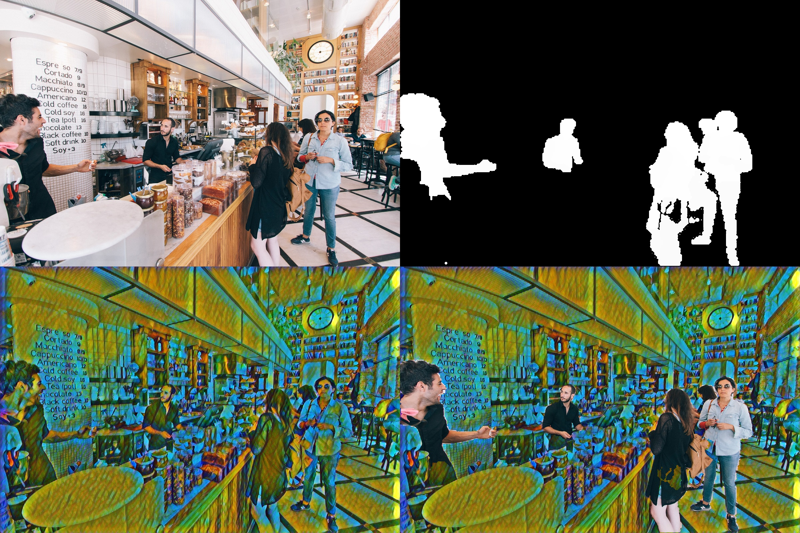

# seg-style
**English** | [中文](./README.CN.md)

A real-time opencv camera process combined with [Light-Weight Refinenet](https://github.com/DrSleep/light-weight-refinenet) and [Fritz Style Transfer Network](https://github.com/fritzlabs/fritz-models/tree/master/style_transfer). 

This repository contains code for both deep learning networks repositories.

Running demo of this repository can get the result of an input image like picture below.

>Top left: Original image. Top right: Mask output from light-weight refinenet. Down left: Stylized image output from the style transfer model. Down right: Final output processed with opencv-python.

## Training and converting models

If you'd like to setup the training environment of the network or convert to mobile version, check out the original `README.md` of the two repositories.To run demos, just simply install the python requirements and download the pretrained models of the two networks.

## Running demos

Demo runs on Tensorflow, PyTorch and Keras simultaneously. Make sure you got these deep learning frameworks installed. Tested on Windows 10 and Ubuntu 18.04 and a GTX1050ti laptop with 19fps.

### Environment Setup

You can use conda or pip to setup packages. You might need to install [keras-contrib](https://github.com/keras-team/keras-contrib) separately.

### Real-time captured demo

Run `demo.py` will take `tmp.jpg` as input and output results of three different refinenet models. The real-time `demo_rt.py` shows the actual combined process using opencv-python to make the image captured with your camera. For the pretrained light-weight refinenet model, three different models will be downloaded at the first time.
